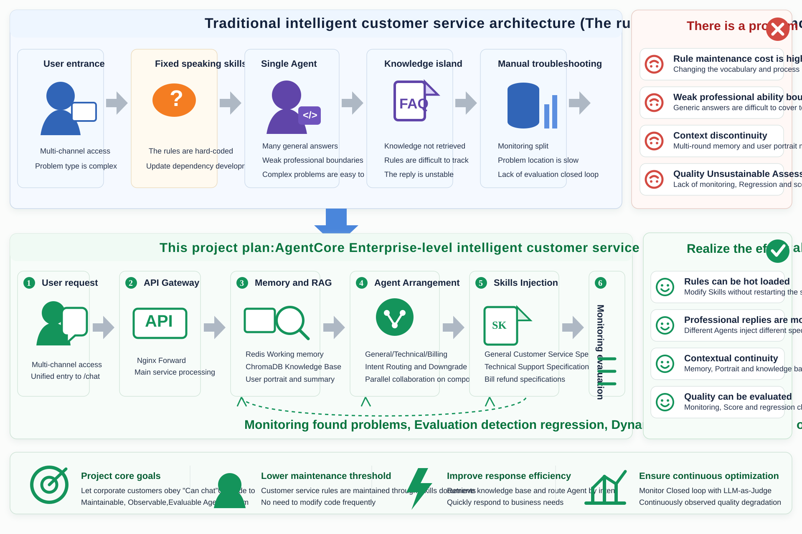
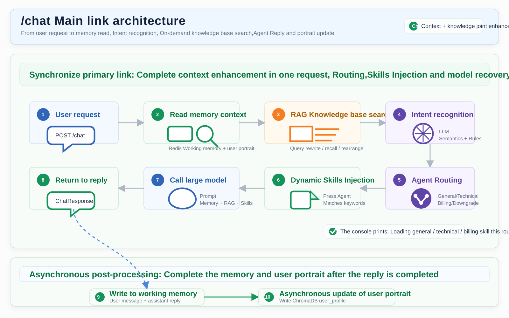
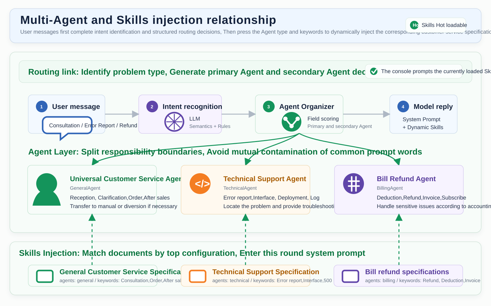
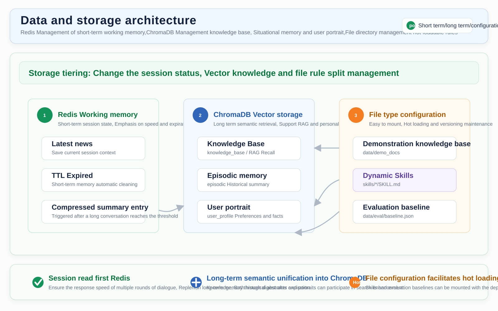
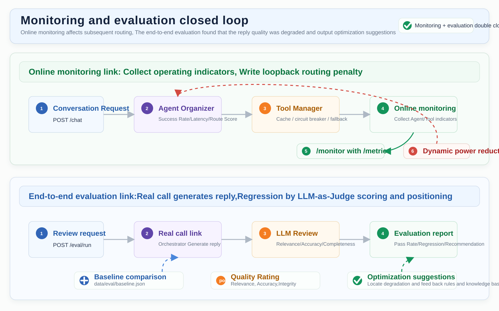
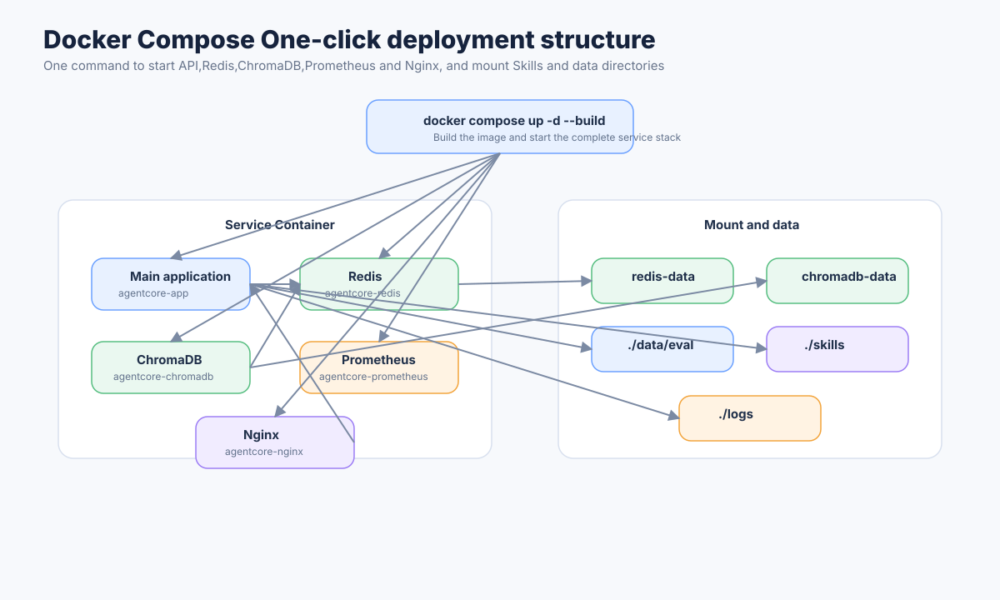

# AgentCore  Project architecture diagram

 This document shows the core architecture diagram of AgentCore. Pictures have been generated to `wiki/assets/architecture/`, can be directly found in wiki,README  or cited in project presentation materials.

 The current architecture focuses on:Docker Compose One-click deployment, Structured multi-agent routing,RAG Knowledge base,Level 3 memory,Dynamic Skills, Monitoring and end-to-end evaluation.

## 1. Overall architecture



 Description:

-  The user requests to enter Nginx first, and then forwarded to the AgentCore main service.
-  Main service provided `/chat`,`/search`,`/skills`,`/eval/run`,`/monitor`,`/metrics`  and other interfaces.
- Redis  assumes working memory,ChromaDB  Responsible for RAG knowledge base, Episodic memory and user portraits.
-  External large models support Anthropic Claude or DeepSeek compatible with the Anthropic protocol.

## 2. `/chat`  Main link architecture



 Description:

- `/chat`  The context in Redis and ChromaDB will be read first.
-  Query rewriting via the MCP toolchain is determined by intent, Parallel recall and result rearrangement.
- Orchestrator According to intention, Keywords and entities calculate domain scores, Generate contains main Agent, Auxiliary Agent and routing reasons `RoutingDecision`.
- Agent  Matching dynamic Skills are injected through SkillManager before calling LLM.
-  After the reply is completed, System writes to working memory, and update the user portrait asynchronously.

## 3. Multi-Agent and Skills injection relationship



 Description:

-  User messages first pass through the IntentRecognizer, Then hand it over to AgentOrchestrator to generate structured routing decisions.
- GeneralAgent,TechnicalAgent,BillingAgent  are responsible for general customer service,Technical support and bill refunds.
-  Compound problems can form `primary_agent + supporting_agents`, After parallel processing, the reply is merged into main processing and auxiliary processing.
-  The three types of Agents load their own Skills respectively:
  -  General customer service reception specifications
  - Technical Support Processing Specifications
  -  Bill refund processing specifications
- Skills Based on `agents`  and `keywords`  Match, Avoid mutual contamination of rules in different fields.

## 4. Data and storage architecture



 Description:

- Redis  Save recent messages for the current session and short-term working memory.
- ChromaDB  contains three core collections:
  - `knowledge_base`:RAG Knowledge Base
  - `episodic`:Historical session summary
  - `user_profile`: User portrait
- `skills/*/SKILL.md`  is a hot-loadable customer service specification.
- `data/eval/baseline.json`  Save the end-to-end evaluation baseline.

## 5.  Monitoring and evaluation closed loop



 Description:

- `/monitor`  Read Agent and tool statistics,Including success rate, Average latency and circuit breaker status.
- Monitor Can calculate `monitor_penalty`, Write back to Orchestrator, Affects subsequent routing scores.
- `/eval/run`  Orchestrator will actually be called to generate a reply, Score again with LLM-as-Judge.
-  Evaluation output pass rate, Score, Regression problems and optimization suggestions.

## 6.  One-click deployment structure



 Description:

-  A single command can start the complete service stack:

```bash
docker compose up -d --build
```

- Compose  will start:
  - `agentcore-app`
  - `agentcore-redis`
  - `agentcore-chromadb`
  - `agentcore-prometheus`
  - `agentcore-nginx`
-  The project will be mounted `./skills`,`./data/eval`  and `./logs`, Convenient hot loading rules, Save measurement baseline and view log.
